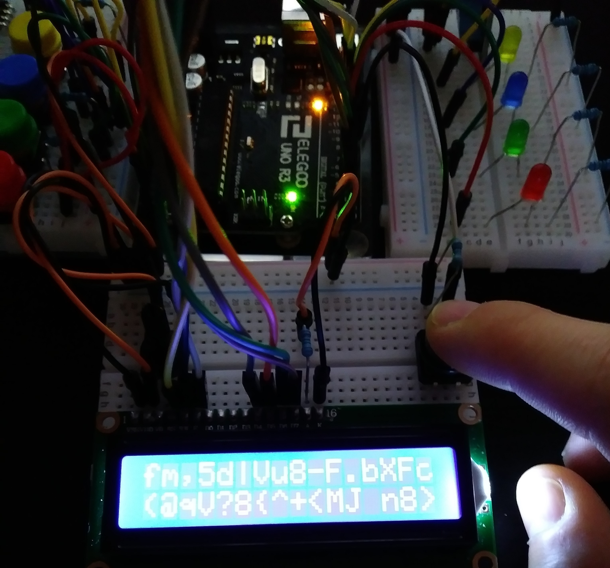

# Why a Password Generator -- 22e60?

> Because obfuscating password generation with a custom-base alphabet is something that struck me on a Thursday night in August. Go figure.

# How?

We ingest stimuli from our immediate environment, and create a unique 32 character string.

## Example
<ul>
  <li>
    Ultrasonic Sensor: 33cm
  </li>
  <li>
    Temperature: 23C
  </li>
  <li>
    Humidity: 24%
  </li>
  <li>
    R LED: 1
  </li>
  <li>
    G LED: 0
  </li>
  <li>
    B LED: 0
  </li>
  <li>
    Y LED: 1
  </li>
  <li>
    Check Sum: 187 (33 + 23 + 24 + 1 + 0 + 0 + 1)
  </li>
</ul>

Password: "fm,5d|Vu8-F.bXfc(@qV?8{^+<MJ n8>"

# Thoughts:

> I could totally make custom glyphs for the liquid crystal display to obfuscate information more. But to what end? haha.

# Statistics

### Total possible permutations: P(n,r) = P(93,32) = 93! / (93−32)!

### = 2.278994482E+60 or 2^200.5040831 or over 200 bits of password security goodness!

### = 2,278,994,482,951,704,616,554,139,354,736,922,451,928,637,507,549,265,920,000,000

Otherwise known as: two novemdecillion two hundred seventy-eight octodecillion nine hundred ninety-four septendecillion four hundred eighty-two sexdecillion nine hundred fifty-one quindecillion seven hundred four quattuordecillion six hundred sixteen tredecillion five hundred fifty-four duodecillion one hundred thirty-nine undecillion three hundred fifty-four decillion seven hundred thirty-six nonillion nine hundred twenty-two octillion four hundred fifty-one septillion nine hundred twenty-eight sextillion six hundred thirty-seven quintillion five hundred seven quadrillion five hundred forty-nine trillion two hundred sixty-five billion and nine hundred twenty million

# Credit
[How to set up an LCD](https://www.youtube.com/watch?v=Mr9FQKcrGpA)

[How to set up a button](https://www.youtube.com/watch?v=VPGRqML_v0w)

[How to set up an Ultrasonic Sensor](https://www.youtube.com/watch?v=ZejQOX69K5M)

[How to set up a DHT11 Humidity Sensor](https://www.youtube.com/watch?v=OogldLc9uYc)
