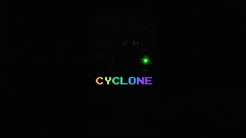

## Why Cyclone?

Because I thought it would be a neat game to make with Arduino! My girlfriend and I
<i>MAY</i> have gotten to over 1000 points because it was so fun. Also we set it to
1ms delay between LED switch and she won <b>three times in a row</b> It was nuts.
But yeah! A lot of fun to make and play with! I also burnt out my first LED while making
this because I put power before resistor while testing for which color these clear LEDs
were and yeah... Lesson learned.

# Credit

How to wire up the oled screen:  https://www.youtube.com/watch?v=A9EwJ7M7OsI&frags=pl%2Cwn  
How to wire up a button:         https://www.youtube.com/watch?v=VPGRqML_v0w  

Thanks for checking out my favorite sketch (thus far)! Much love.
