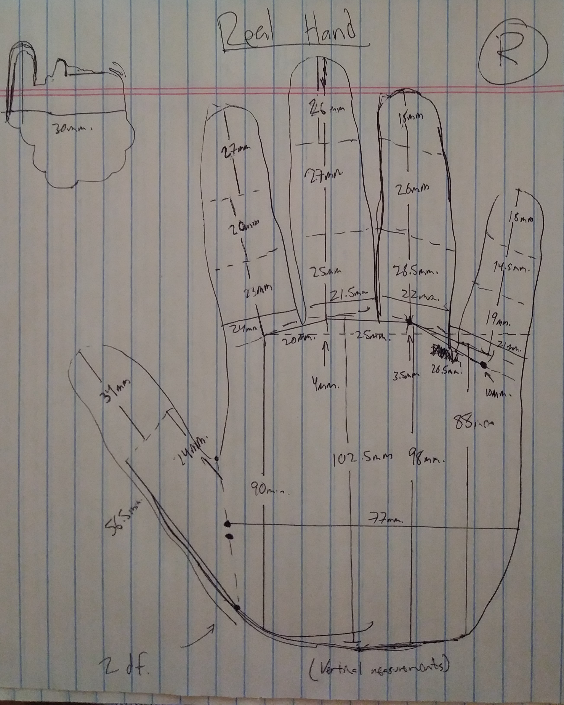

# 12-16-18

So yesterday I did this for about an hour or so and took initial measurements of my right hand to see how this will scale. 

I figure that because my servos are all 30mm, I would have to scale the product up by maybe 1.5x because the servo width is more than the actual width between my index finger's palm-first-knuckle joint to my middle finger's palm-first-knuckle joint. So if I need >= 1mm. of clearance between each joint, AND the smallest width between first joints is 20mm., then it makes sense to scale the entire thing by 1.55x to allow full range of motion of the servo that is my middle finger's first joint. So I will make a stationary palm that acts as a stand for the finger servo modules. 

I figure I can create a finger class that can inherit as many joints as possible that are needed. But for now I haven't really thought about that yet. It's just a gut design choice so far. So for now, I'm going to start on the palm stand right now.

### Update 1.1: 

I think I underestimated that measurement of how much clearance I needed because I didn't take into account the amount of material I'll use to simulate the actual finger so I might need 3mm. or more to get clearance. 

### Update 1.2: 

I actually totally muffed the measurements because I wasn't using a consistent reference point <i>per joint</i>. So now I'll just redo the measurements and put'm in a table.

## Finger Dimensions
<table>
  <tr>
    <th> Measurement </th>
    <th> Thumb </th>
    <th> Index Finger </th>
    <th> Middle Finger </th>
    <th> Ring Finger </th>
    <th> Pinky Finger </th>
  </tr>
  <tr>
    <th> First Joint to Bottom of Palm Height [y axis] (mm) </th>
    <td> N/A </td>
    <td> 96.5 </td>
    <td> 101 </td>
    <td> 95 </td>
    <td> 80 </td>    
  </tr>
  <tr>
    <th> First Joint to Side of Palm Width [x axis] (mm) </th>
    <td> 83 </td>
    <td> N/A </td>
    <td> N/A </td>
    <td> N/A </td>
    <td> N/A </td>    
  </tr>
  <tr>
    <th> Degrees of Freedom (df) </th>
    <td> 2 </td>
    <td> 3 </td>
    <td> 3 </td>
    <td> 3 </td>
    <td> 3 </td>    
  </tr>
  <tr>
    <th> First Joint Height (mm) </th>
    <td> 40 </td>
    <td> 26 </td>
    <td> 30 </td>
    <td> 26 </td>
    <td> 19 </td>    
  </tr>
  <tr>
    <th> Second Joint Height (mm) </th>
    <td> 30 </td>
    <td> 19.5 </td>
    <td> 22 </td>
    <td> 20.5 </td>
    <td> 14 </td>    
  </tr>
  <tr>
    <th> Third Joint Height (mm) </th>
    <td> N/A </td>
    <td> 27 </td>
    <td> 28 </td>
    <td> 27 </td>
    <td> 24 </td>    
  </tr>
  <tr>
    <th> First Joint Width (mm) </th>
    <td> 21 </td>
    <td> 21 </td>
    <td> 20 </td>
    <td> 19 </td>
    <td> 17.5 </td>    
  </tr>
  <tr>
    <th> Second Joint Width (mm) </th>
    <td> 21 </td>
    <td> 18 </td>
    <td> 18 </td>
    <td> 16 </td>
    <td> 16 </td>    
  </tr>
  <tr>
    <th> Third Joint Width (mm) </th>
    <td> N/A </td>
    <td> 15.5 </td>
    <td> 16 </td>
    <td> 15 </td>
    <td> 13 </td>    
  </tr>
</table>

So now that I have these measurements, I need to figure out how much I'm going to scale the entire thing. I'm thinkin' that I could get away with about 1.75x or so. I would love to have a perfectly proportional replica that's scaled by 2x or 2.25x but I need to consider weight that can be adequately supported by the servos. Maybe I'll have to use styrofoam or something to lighten the fingers but we'll have to see.

Next I should measure the range of motion per joint. I guess extended finger position will be 0 or baseline to simplify the different ranges of motion. So for example, extended finger servo position would be 0 degrees, and resting finger servo position for the index finger would be 12 degrees or so. Since these servos are based on a 180 degree range, I will constrain joint movement to 180 degrees (probably will have to be less because each specific joint doesn't really contribute THAT much range of motion).

## TO BE MEASURED
<table>
  <tr>
    <th> Measurement </th>
    <th> Thumb </th>
    <th> Index </th>
    <th> Middle </th>
    <th> Ring </th>
    <th> Pinky </th>
  </tr>
  <tr>
    <th> First Joint Resting (mm) </th>
    <td> </td>
    <td> </td>
    <td> </td>
    <td> </td>
    <td> </td>
    <td> </td>
  </tr>
  <tr>
    <th> First Joint Flexion (mm) </th>
    <td> </td>
    <td> </td>
    <td> </td>
    <td> </td>
    <td> </td>
    <td> </td>
  </tr>
</table>
