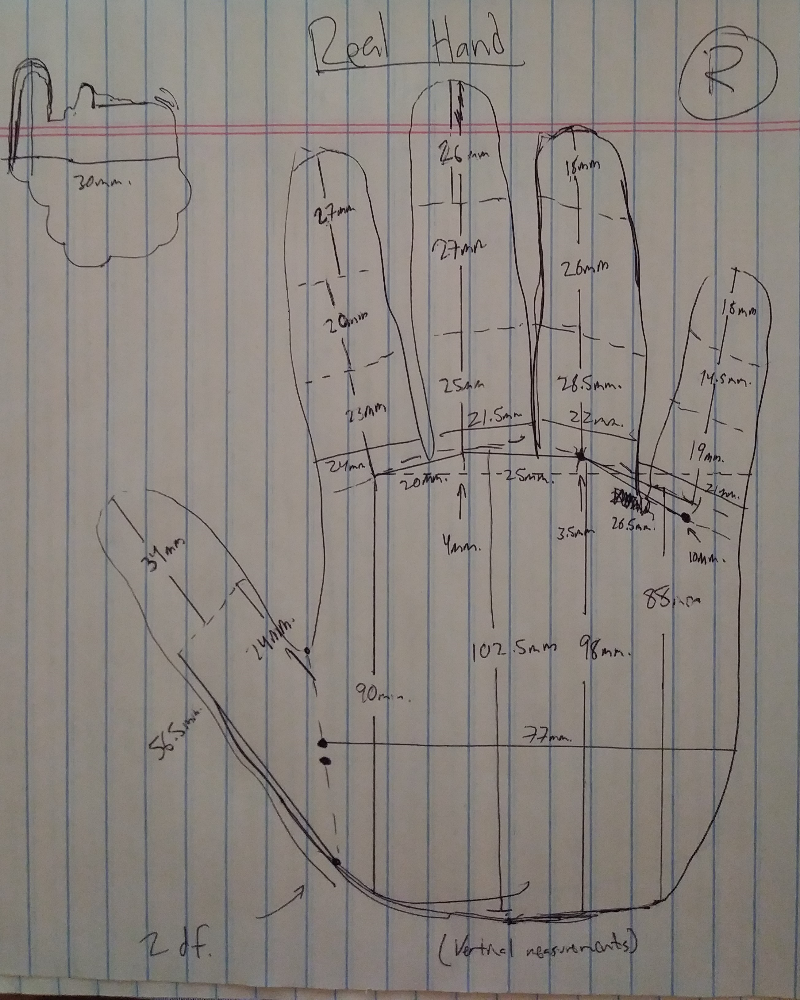

# Robot Hand - 12-15-18 - current

Hello visitor!

This is my very own robot hand using Arduino and some good old fashioned cardboard and servos! The readme specifically will document my thoughts and how I'm going about making this thing. So here we go!

## 12-16-18

So yesterday I did this for about an hour or so and took initial measurements of my right hand to see how this will scale. 

<table>
  <tr>
    <th> Measurement</th>
    <th> Thumb </th>
    <th> Index Finger </th>
    <th> Middle Finger </th>
    <th> Ring Finger </th>
    <th> Pinky Finger </th>
  </tr>
  <tr>
    <td> Degrees of Freedome </td>
    <td> 2 </td>
    <td> 3 </td>
    <td> 3 </td>
    <td> 3 </td>
    <td> 3 </td>    
  </tr>
</table>

I figure that because my servos are all 30mm, I would have to scale the product up by maybe 1.5x because the servo width is more than the actual width between my index finger's palm-first-knuckle joint to my middle finger's palm-first-knuckle joint. So if I need >= 1mm. of clearance between each joint, AND the smallest width between first joints is 20mm., then it makes sense to scale the entire thing by 1.55x to allow full range of motion of the servo that is my middle finger's first joint. So I will make a stationary palm that acts as a stand for the finger servo modules. 

I figure I can create a finger class that can inherit as many joints as possible that are needed. But for now I haven't really thought about that yet. It's just a gut design choice so far. So for now, I'm going to start on the palm stand right now.

Update 1.1: I think I underestimated that measurement of how much clearance I needed because I didn't take into account the amount of material I'll use to simulate the actual finger so I might need 3mm. or more to get clearance.
