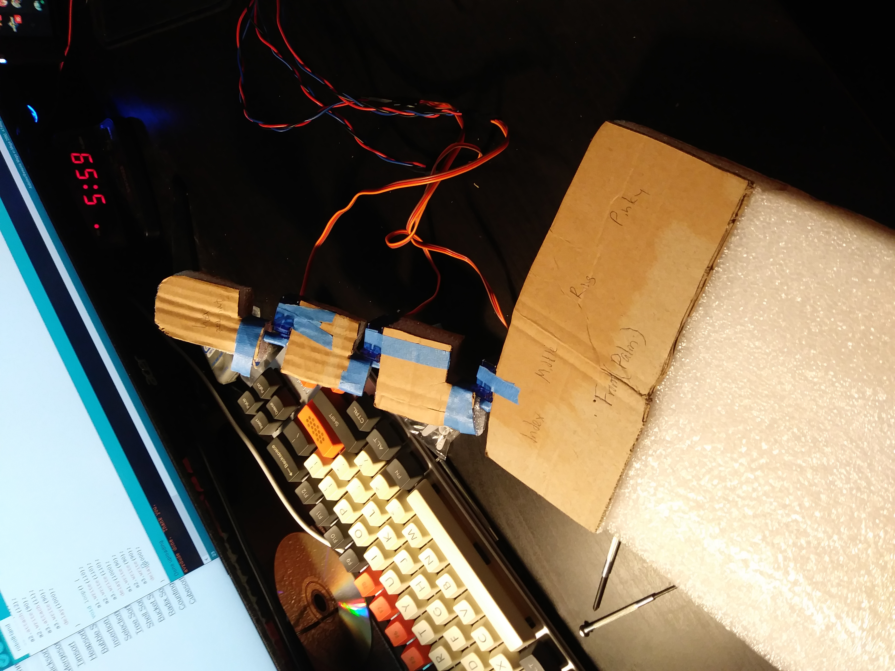

# Robot Hand
### by David Amante 

Hello visitor!

This is my very own robot hand using Arduino and some good old fashioned cardboard and servos! 

## Update December 26, 2018:

I ended up scrapping this project for the time being because I had intermittent servo activity while trying to prototype the framework and I think I burnt out one of the servos, so for now until I can get a larger than 130 degree range of motion and industrial-ish level servos for moving more than 100g. of weight this will be as far as I got.

